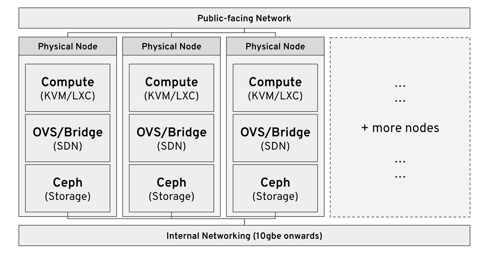

# Hyper-converged Private Cloud Guide

The goal of this repository is to provide a comprehensive and beginner-friendly guide to building a hyper-converged private cloud on commodity hardware.

## Index

* [What is hyper-convergence?](#hyper-convergent-infrastructure)
* Hypervisor: Proxmox
* Storage: Ceph
* Networking: Linux Bridge

## What is hyper-convergence?

### TLDR

Hyper-convergent infrastructure means that all (most) datacenter components are in one standardised chassis. Instead of having separate storage (SAN) and compute clusters (virtualisation) clusters/node, every node serves a portion of both services.

### Advantages

* Lower complexity (one type of device/node)
* Higher resource utilisation (can utilise excess CPU previous locked away in storage nodes)
* Lower footprint (especially for smaller-scale deployments)
* Easy to gradually scale horizontally over time by adding new nodes

This takes the form of: 

* Software defined compute
* Software defined storage
* Software defined network

### Open-source Technologies involved

* Proxmox
* Ceph
* Open vSwitch